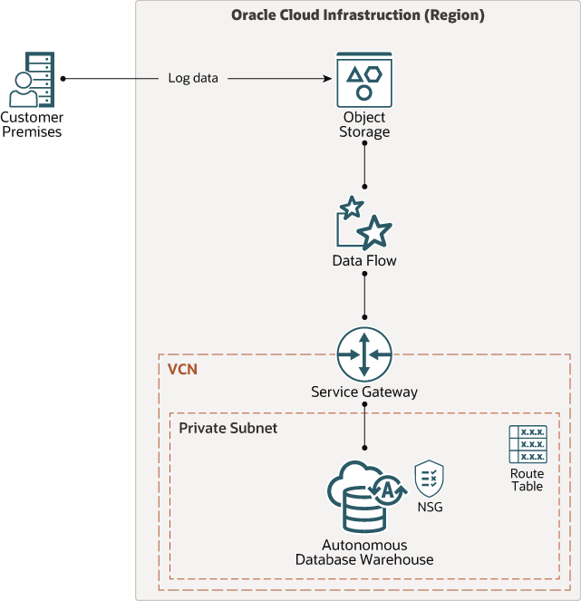

# oci-arch-dataflow-store-analyze-data

Provision the cloud infrastructure and deploy the PySpark code for automated uploading, processing, and storing of on-premises log data in the cloud. The data is staged in Object Storage, processed in Data Flow, and stored in Autonomous Data Warehouse for analysis.

Oracle Cloud Infrastructure Data Flow is a fully managed Apache Spark ™ service that is ideal for processing large volumes of log files.

Data Flow allows for centralized storage of log data in Oracle Cloud Infrastructure Object Storage. It enables analysis of the data by creating an Apache Spark application once and then running it on new log files as they arrive in Object Storage. The output of this analysis can then be loaded to Autonomous Data Warehouse for querying and reporting.

## Implementation

The terraform scripts in this repository are in support of the Tutorial [Set up Data Flow to Process Your On-premises logs in Oracle Cloud Infrastructure][]. Refer to that Tutorial for instructions on how to set up your tenancy and apply these scripts.

## Reference Architecture

You can view the [Store and analyze your on-premises logs in Oracle Cloud Infrastructure][] Reference Architecture document for a description of the architecture and for Recommendations and Considerations when implementing this architecture.

[Store and analyze your on-premises logs in Oracle Cloud Infrastructure]: https://docs.oracle.com/en/solutions/analyze-logs/index.html
    "Store and analyze your on-premises logs in Oracle Cloud Infrastructure"
[Set up Data Flow to Process Your On-premises logs in Oracle Cloud Infrastructure]: https://docs.oracle.com/en/learn/architecture-analyze-logs/index.html
    "Set up Data Flow to Process Your On-premises logs in Oracle Cloud Infrastructure"
